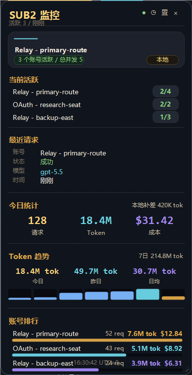

# Sub2API Floating Monitor

A small Windows desktop floating monitor for Sub2API and local Codex/Claude usage logs.



一个轻量的 Windows 桌面悬浮窗，用来查看 Sub2API 当前活跃账号、并发、今日 token、成本统计，也可以在没有 Sub2API 的情况下读取本机 Codex/Claude 日志。适合多账号中转、本地 Codex 使用量观察，以及排查“请求到底走了哪个通道”。

It can run in two useful ways:

- `auto`: read Sub2API admin metrics when available, then fall back to local client logs.
- `local-codex`: read local Codex/Claude JSONL logs only. This mode does not need Sub2API or any API key.

When Sub2API is connected, the monitor shows Sub2API server-side stats by default. Local client logs are not merged into the total unless `SUB2API_INCLUDE_LOCAL_USAGE=true`, because Codex still writes local token logs even when requests go through Sub2API.

In `auto` usage-source mode, the monitor checks the current Codex endpoint. If Codex points to your Sub2API URL, totals come from Sub2API only. If Codex points somewhere else, totals come from local client logs.

## Features

- Always-on-top resizable desktop floating window.
- Current active Sub2API accounts and concurrency.
- Today's request count, token count, and estimated cost.
- Account ranking with token, cost, request count, and simple health badges.
- Local daily cost history in `usage_history.json`, with today/yesterday/7-day trend.
- Local Codex/Claude token import for conversations that did not pass through Sub2API.
- Codex fork replay de-duplication to avoid inflated token totals after branching a session.
- UTC+8 footer clock.

## Requirements

- Windows
- Python 3.10+
- Tkinter, included in the standard Python installer on Windows

No Python packages are required.

## Quick Start

Local-only mode:

```powershell
.\start-local-codex.ps1
```

Auto mode:

```powershell
.\start-monitor.ps1
```

Or run directly:

```powershell
python .\monitor.py
```

## Sub2API Mode

Copy `.env.example` to `.env`, then fill in your local admin settings:

```env
SUB2API_MONITOR_MODE=auto
SUB2API_BASE_URL=http://127.0.0.1:8080
SUB2API_ADMIN_EMAIL=admin@sub2api.local
SUB2API_ADMIN_PASSWORD=your-password
```

Use strict Sub2API mode if you do not want fallback:

```env
SUB2API_MONITOR_MODE=sub2api
```

## Local Codex Mode

Local mode scans:

- `%USERPROFILE%\.codex\sessions`
- `%USERPROFILE%\.claude\projects`

It writes a generated `client_usage_today.json` next to the scripts. This file is ignored by Git.

The monitor also keeps a local `usage_history.json` ledger for daily request, token, and cost snapshots. It is ignored by Git and can be moved with `SUB2API_USAGE_HISTORY_JSON`.

Useful settings:

```env
SUB2API_MONITOR_MODE=local-codex
CLIENT_USAGE_CODEX_DEFAULT_MODEL=gpt-5.5
CLIENT_USAGE_MAX_SINGLE_EVENT_TOKENS=2000000
SUB2API_INCLUDE_LOCAL_USAGE=false
SUB2API_MONITOR_USAGE_SOURCE=auto
SUB2API_USAGE_HISTORY_JSON=
```

`CLIENT_USAGE_MAX_SINGLE_EVENT_TOKENS` is a guardrail for abnormal single events.

Set `SUB2API_INCLUDE_LOCAL_USAGE=true` only when you intentionally want Sub2API server stats and local client logs shown together. This is useful for comparing sources, but it can double count requests that already passed through Sub2API.

`SUB2API_MONITOR_USAGE_SOURCE` can be:

- `auto`: detect the current Codex endpoint.
- `sub2api`: always use Sub2API server-side stats.
- `local`: always use local Codex/Claude logs.
- `both`: show Sub2API stats plus local logs together.

If your Sub2API is reachable through more than one local URL or port, set:

```env
SUB2API_MATCH_BASE_URLS=http://127.0.0.1:8080,http://localhost:8080
```

## Forked Codex Sessions

Codex can replay previous context into a forked session. If a usage importer treats those replayed totals as new work, daily token counts can jump dramatically.

This version detects `session_meta.payload.forked_from_id`, skips the initial replay window, de-duplicates repeated total counters, and prefers `last_token_usage` when present.

## Files

- `monitor.py`: floating window and Sub2API/local data source.
- `client_usage_export.py`: local Codex/Claude JSONL usage scanner.
- `start-monitor.ps1`: normal auto-mode launcher.
- `start-local-codex.ps1`: local-only launcher.
- `run-monitor.cmd`: CMD launcher.
- `run-client-usage-export.cmd`: export local usage JSON once.

## Privacy

Local mode reads only local usage logs and does not send them anywhere. Sub2API mode talks only to the `SUB2API_BASE_URL` you configure.
